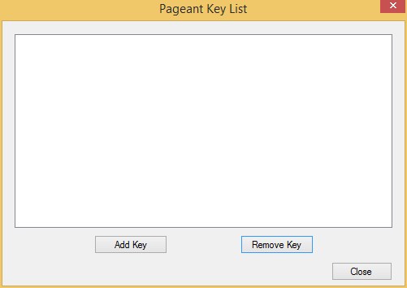
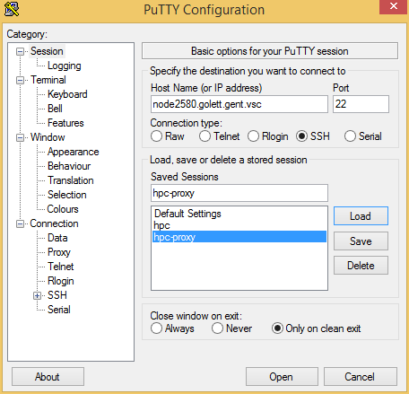
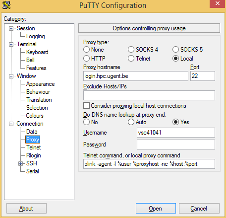
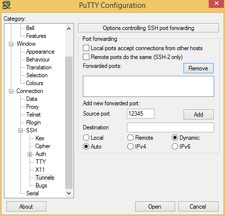
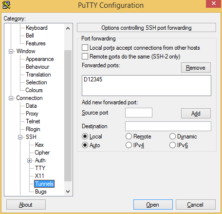
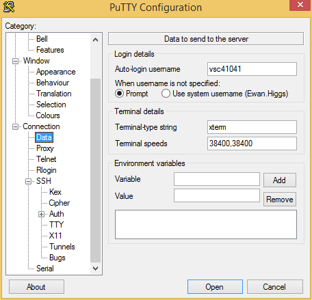

.. _configuring_putty_on_windows:

Configure PuTTY on Windows
--------------------------

To configure PuTTY on Windows we need to do the following tasks:

1. Download the required software.
2. Add our key to Pageant.
3. Configure PuTTY.

Download the required software
------------------------------

To work with Hanythingondemand from Windows, you need to download and install a couple of tools.
All of the following are available from the PuTTY website:
http://www.chiark.greenend.org.uk/~sgtatham/putty/download.html

1. PuTTy - The ssh client.
2. Plink - A command line interface to the PuTTy back ends.
3. Pageant  - A key manager used to allow PuTTy and Plink to play together.

Add your keys to Pageant
------------------------
Double click the Pageant icon to run the service. Right click the icon in the
systray and click ``Add keys``. You will be presented with a window as follows:

Click ``Add Key`` and select your ``ppk`` file. If it is password protected, you
will be prompted to enter your password. Please do so.

Configure PuTTY for the Tunnel
------------------------------

Configure ``Session``
++++++++++++++++++++++++++++++++++++
Open PuTTY and make a new connection. The connection should point to the master
node of your HOD cluster.

Configure ``Connection -> Proxy``
+++++++++++++++++++++++++++++++++
Make the proxy local.

Under ``Proxy hostname`` enter the name of your login node. e.g. For the Ghent
University, we use ``login.hpc.ugent.be``.

Set your DNS name lookup at proxy end to Yes. This will let you connect to the
resulting host if your HPC team hasn't all the nodes to your HPC site's DNS.
Set your username.

Under ``Telnet command, or local proxy command``, enter the following command: 

.. code::
    plink -agent -l %user %proxyhost -nc %host %port

Configure ``Connection -> SSH -> Tunnel``
+++++++++++++++++++++++++++++++++++++++++

Make a connection that uses ``Auto`` and ``Dynamic``. Select a port number which
will later be used in your browser. In the screenshots, ``12345`` is used, but
it can be any unpriveleged port.

Click ``Add`` to put the configuration in place, which should make the port number appear
in the list of forwarded ports:

Configure ``Connection -> Data``
++++++++++++++++++++++++++++++++
 Add your user name under ``Auto-login username``.  This is required here so ``plink`` can use this.

Saving the configuration
++++++++++++++++++++++++

There are a lof of things to change here, so be sure to go back to ``Session``
and give your configuration a name and ``Save`` it so you can reuse it via ``Load`` in the future.
