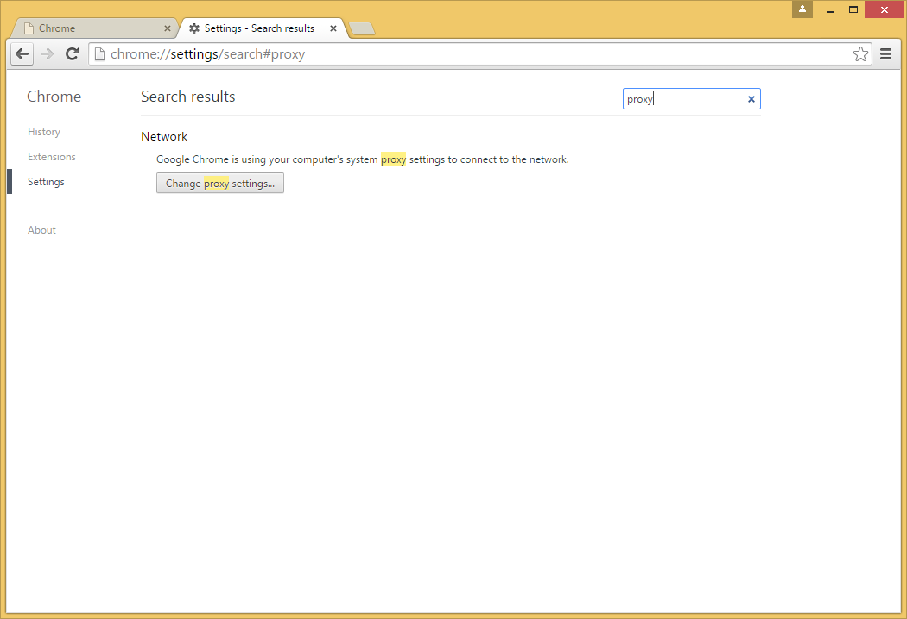
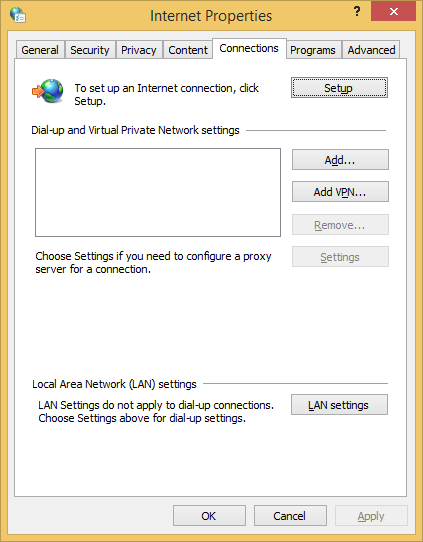

.. _browser_proxy_chrome_windows:

1. Open ``Settings`` in Chrome, search for ``Change proxy settings`` button (and click it)

2. In the ``Internet Properties`` window, click ``LAN settings``

3. In the ``Local Area Network (LAN) settings`` window, enable ``Use a proxy server for your LAN``,
   and click ``Advanced``

.. image:: img/browser_proxy_cfg/chrome_windows/02_lan_settings.png

4. In the ``Proxy settings`` window, enter ``localhost`` as proxy address for the ``Socks`` proxy type, and
   enter the port number you used when setting up the SSH tunnel, e.g. ``12345`` or ``10000``.

.. image:: img/browser_proxy_cfg/chrome_windows/03_proxy_settings.png
