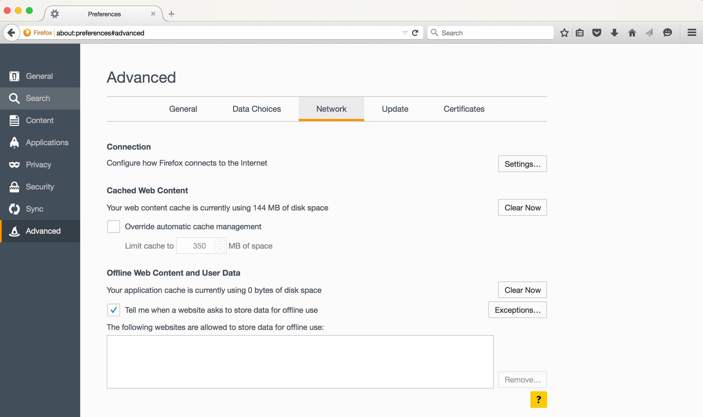
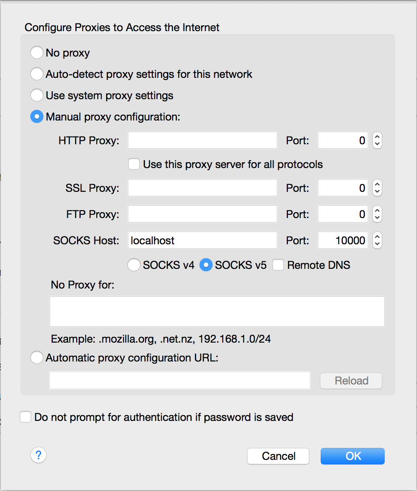

.. _browser_proxy_firefox:

Browser proxy configuration for Firefox
=======================================

.. note::
  Keep in mind that using the proxy will only work while you have access to the workernode for which the SSH tunnel
  was set up, i.e. while the HOD cluster is running, and while you are able to connect to the HPC infrastructure.

  To reset your browser configuration back to normal, simply disable the proxy in your browser configuration.

1. Navigate to the ``Advanced`` tab of the ``Preferences`` window of Firefox, and click ``Settings``
   in the ``Connection`` section

2. Select ``Manual proxy configuration``, enter ``localhost`` as ``SOCKS Host``, and enter the port number you used
   when setting up the SSH tunnel.

   Make sure that the ``No Proxy for:`` box is *empty* (in particular, ``localhost`` should *not* be listed there).

   Click ``OK`` to save the configuration.

