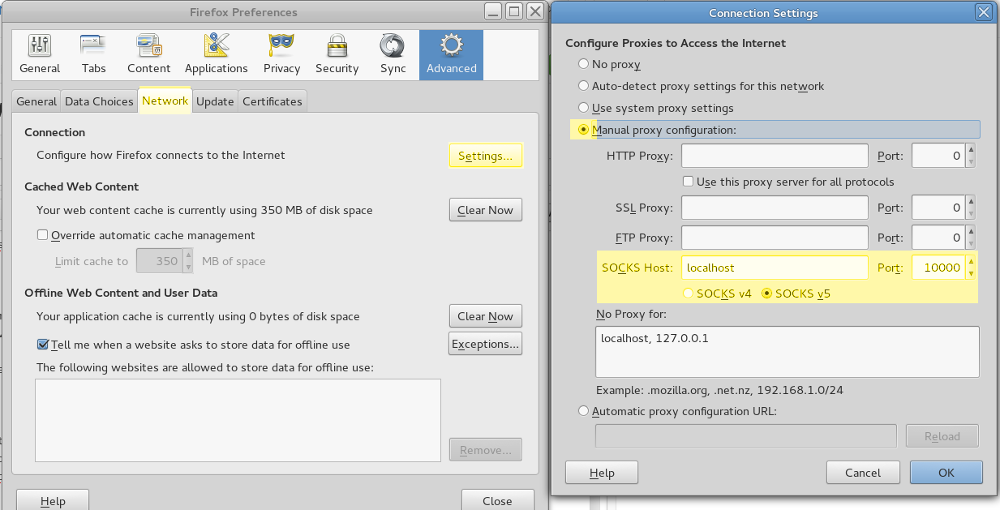

============
Web Services
============
The Hadoop stack has a suite of web services which make it easy to monitor jobs which are running. It's really useful for checking on progress of large jobs. You can use these same tools with hanythingondemand! However, as we are jumping through login nodes to the worker node in a cluster, the user experience for accessing the web services is not slick.

To set this up, we need to follow these steps:

1. Open a SOCKS server connecting your local machine to the node.
2. Set up SOCKS in our browser.
3. Access the page.

--------------------------------------------------------------
Open a SOCKS server connecting your local machine and the node
--------------------------------------------------------------
To set up a SOCKS server connecting your local machine and the worker node, you need to set up your ``ssh`` config to allow you to login from your local machine directly into the node (via the login node as a proxy). What follows is a generalised version from our cluster, but if you need help, please contact your administrators for help in setting this up.

You can have the following in your `~/.ssh/config`::

    Host node1234.mycluster
        ProxyCommand ssh -q loginnode.mydomain 'exec nc -w 21600 %h %p'
        User username

Then from the command line, run the following to forward port 10,000 to your machine. This command will set up a SOCKS server. Note that it doesn't need to be 10,000, just any non privileged port (ports < 1024 are privileged and only the administrator can use them).

```ssh -D 10000 node1234```

--------------------------
Set up SOCKS in our browser
--------------------------

In Firefox, go to Edit ➡ Preferences ➡ Advanced ➡ Connection/Settings...



**Note that the general internet may become unavailable while you have the browser setup with the SOCKS proxy so you will need to revert your settings to resume normal service.**
 
---------------
Access the page
---------------
On the node you can check the IP by running `ip addr show` and taking the ip of the 'em1' interface. The services should then be available in your browser. Note that the `em1` interface might have a different name on your cluster. If you aren't sure you can either ask your administrators.

From `this page <http://blog.cloudera.com/blog/2009/08/hadoop-default-ports-quick-reference/>`_ we can get the default ports for the browser:

For example, the job tracker might be accessible from: ``http://10.1.1.234:50030``
